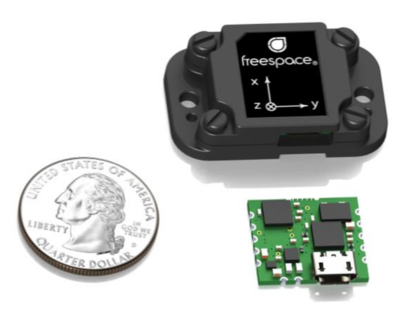

# Freespace FSM-9 IMU ROS Node
### Jordan Ford
This is an unofficial ROS node for the [FSM-9](https://www.hillcrestlabs.com/products/fsm-9) Inertial Measurement Unit (IMU) from [hillcrestlabs](https://www.hillcrestlabs.com).

